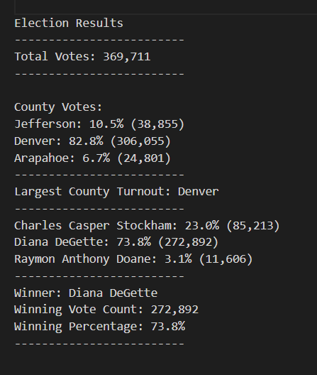

# Election-Analysis
## Overview of Election Audit
The purpose of this project was to complete an election audit and submit it to the election committee. The audit had to calculate the total number of votes cast, Get a complete list of candidates who received votes, calculate the total number of votes each candidate received, calculate the percentage of votes each candidate won, and determine the winner of the election based on popular vote.
## Election-Audit Results
* The total amount of votes that were casted in this congressional election was 369,711. 
* A breakdown of the  number of votes and percentage of total votes for each county, as well as the breakdown of  the number of votes and the percentage of total votes each candidate received can be seen in the image below. 

  

* Denver had the largest number of votes with a total of 82.8%. Jefferson followed second with 10.5%, and Arapahoe last with 6.7%  of the total votes.
* After auditing the data, the winner of the election was Diana receiving 272,892 votes and received 73.8% of the total votes. 
## Election-Audit Summary
The script that was written was very helpful in auditing the election results since it was a large data file. The script can be modified and used for any elections. If you wanted to know the number of voters for each candidate in a specific county, the script could be modified. This could be helpful to know where the candidates had a better turnout rate. Another example is if further details were given in the data file, then the code could be modified to show more results. 
